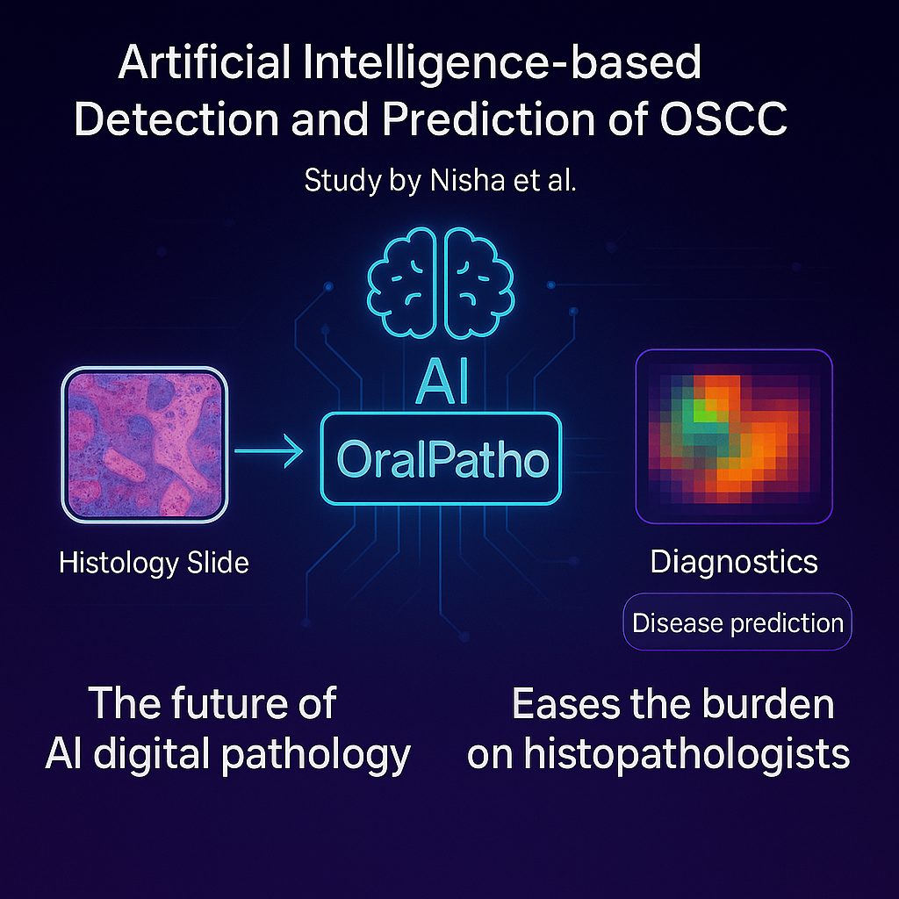

# OralPatho



**OralPatho** is a dual-stage AI system for **pathologist-free tumor detection** and **histological grading** of **Oral Squamous Cell Carcinoma (OSCC)** using whole-slide histopathology images (WSIs). Trained on 1900+ WSIs from multiple institutions, it achieves expert-level accuracy for both cancer detection and subtyping, with patch-level visual interpretability.

---

## 🔍 Key Features

-  Dual-stage MIL framework for normal-vs-tumor classification and tumor grading (WD, MD, PD)
-  Patch-level attention heatmaps for explainability
-  Preprocessing notebooks for patch extraction, normalization, and mapping
-  Fully modular training and testing pipeline (binary + multiclass)
-  Jupyter-based **interactive interface** for end-to-end usage

---

## 📁 Repository Structure

```
oralpatho/

| Folder/File             | Description |
|------------------------|-------------|
| `src/`                 | Core pipeline modules for preprocessing, model training, and utilities |
| ├── `preprocessing/`   | Jupyter notebooks for patch extraction, feature generation, normalization |
| ├── `training/`        | Training scripts for binary and multiclass MIL models |
| ├── `models/`          | MIL model architecture definitions |
| ├── `datasets/`        | Custom dataset loaders for WSI classification |
| ├── `utils/`           | Data collation and helper functions |
| └── `visualization/`   | Notebook for generating attention heatmaps |
| `interface/`           | Scripts for interactive WSI-based inference and visualization |
| `testing/`             | Scripts for evaluating binary and multiclass models |
| `docs/`                | Figures and documentation resources |
| `requirements.txt`     | Python package dependencies |
| `README.md`            | Project overview and usage guide |

```

---

## ⚙️ Installation

```bash
# Clone the repository
git clone https://github.com/NishaChaudhary23/oralpatho.git
cd oralpatho

# (Optional) Create and activate a virtual environment
python3 -m venv venv
source venv/bin/activate

# Install dependencies
pip install -r requirements.txt
```

---

## 🚀 Quick Start

1. **Place WSIs and metadata** inside the `data/` directory.
2. **Preprocess** using Jupyter notebooks in `src/preprocessing/`.
3. **Train models:**
   - Binary classification: `src/training/binary/train_binary.py`
   - Multiclass grading: `src/training/multiclass/train_multiclass.py`
4. **Test models:** using scripts in `testing/`
5. **Visualize attention heatmaps:** from saved attention scores in `results/`.

---

## 🧪 Interactive Interface (NEW)

A lightweight, modular interface is available for researchers and clinicians to interactively:

- Extract patches and compute features from WSIs
- Run MIL model inference
- Visualize attention-based heatmaps

### 🔧 To Run:

```bash
cd interface/
jupyter notebook oralpatho_interface.py
```

Make sure your WSIs and extracted features are accessible at configured paths. The interface uses `ipywidgets` for tabbed navigation and real-time execution.

---

## 📄 Citation

If you use OralPatho in your research, please cite:

> **Chaudhary N, et al.** *OralPatho: Pathologist-Free Dual-Stage AI System for Tumor Detection and sub typing in Oral Squamous Cell Carcinoma*. medRxiv 2025.  
> [https://doi.org/10.1101/2025.06.05.25329090](https://doi.org/10.1101/2025.06.05.25329090)

---

## 👩‍⚕️ Contact

- **Lead Developer**: Nisha Chaudhary – [nickychaudhary23@gmail.com](mailto:nickychaudhary23@gmail.com)  
- **Mentor**: Dr. Tanveer Ahmad  
- **Affiliation**: Jamia Millia Islamia, New Delhi

> This project is developed to enable accessible, interpretable, and scalable cancer diagnostics—especially in low-resource clinical settings.
